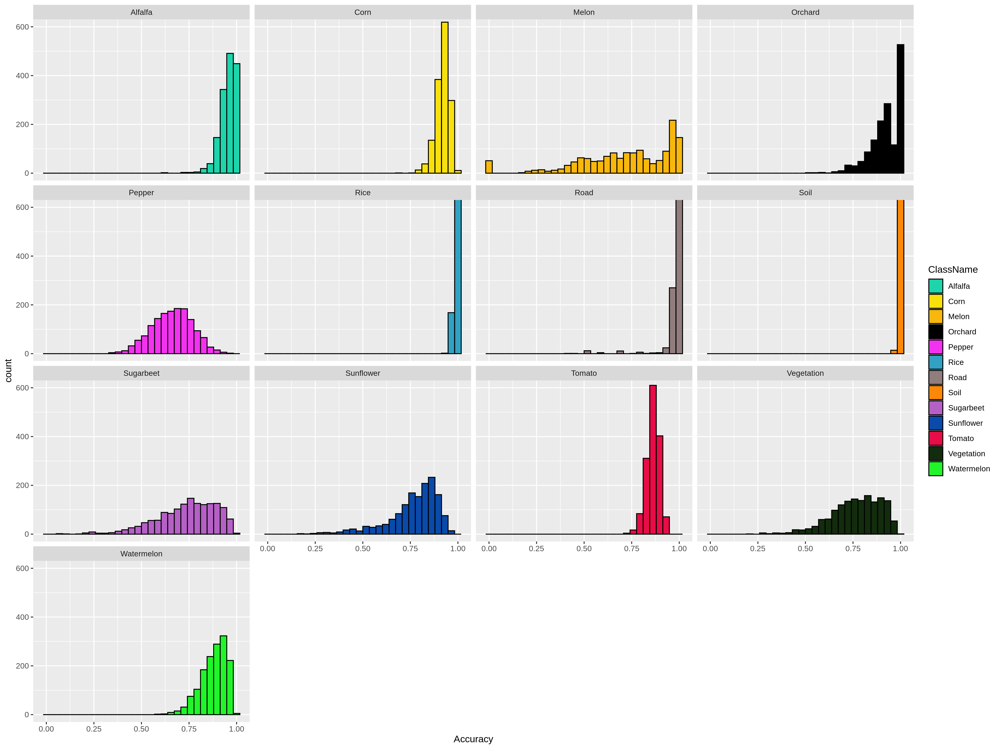
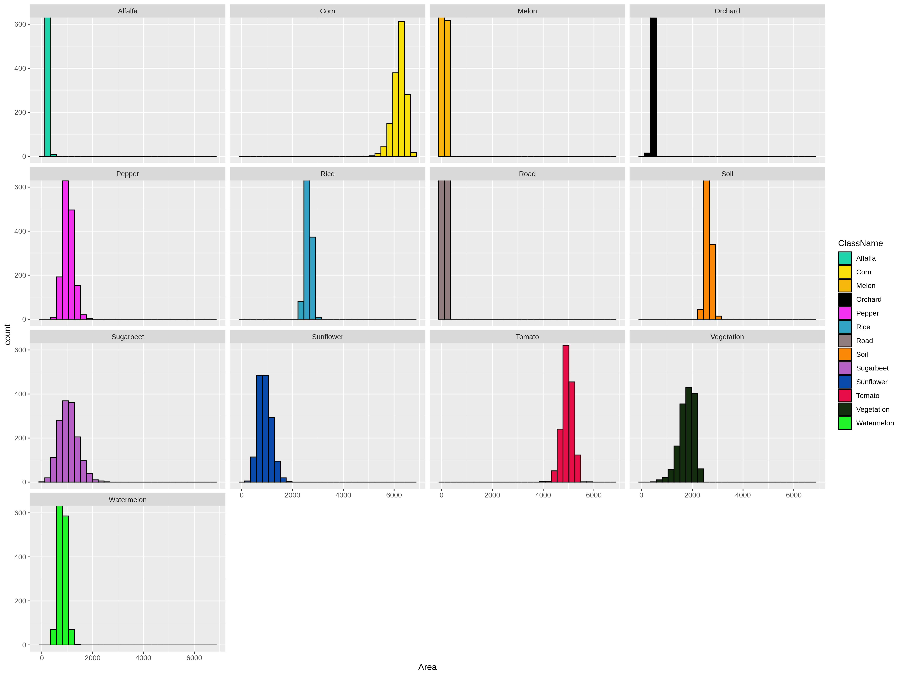
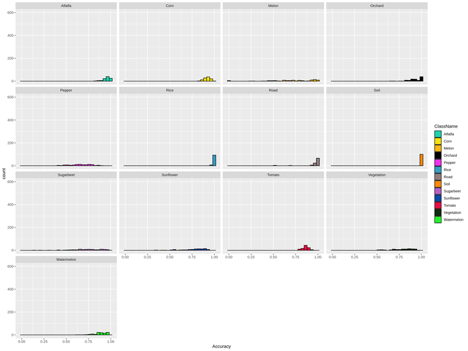
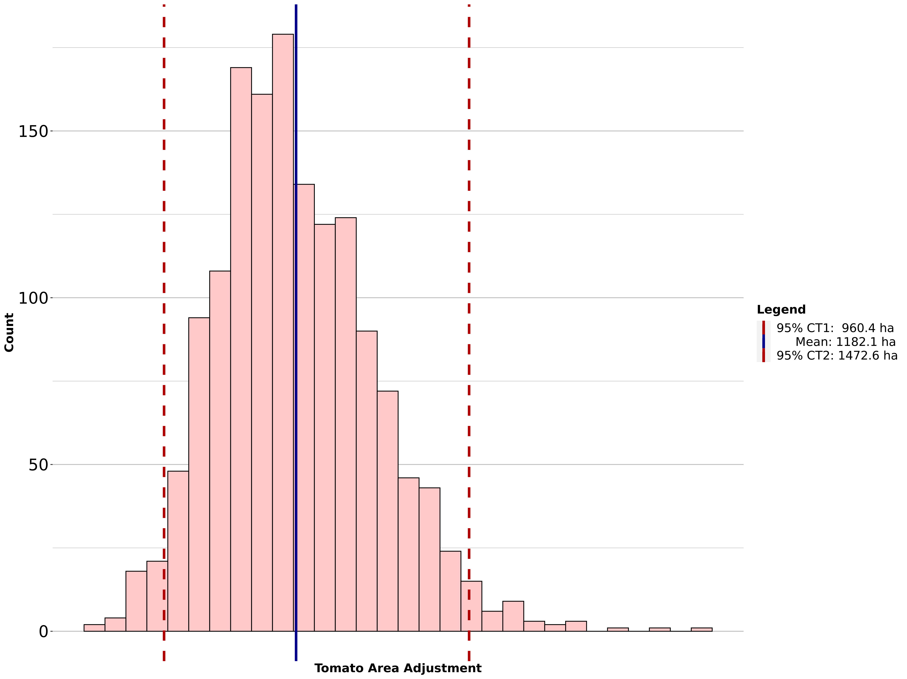

# bootmap </a>

Bootmap is an R framework for calculating uncertainty metrics from a crop map.
We are now working on a paper to elaborate on our procedure and results.
A detailed documentation and a R package structure will be organized in this repository.

Hopefully, you will be able to create graphics and tables for your map accuracy assessments:

### Alluvial Plot

### Bootstrap Accuracy & Area Plots

Accuracy Table              |  Area Table
:-------------------------:|:-------------------------:
  |  

As you increase **n** in bootstrap, the crops with enough sample converges to normal distribution. They grow just as plants!

### Bootstrap Accuracy & Area Tables

Accuracy Table              |  Area Table
:-------------------------:|:-------------------------:
  |  

### Crop Area Adjustment Uncertainty Plot

## OOP Plan

`bootmap` is going to be an object that stores the following:

- A result map with one band as classification results
- Sample vector data
- Class integer and text values
- Confusion matrix
- Class area frame
- Methods:
	- extract_map_accuracy
	- boot_sample
	- boot_accuracy
	- boot_stat
	- boot_table
	- calc_interval_frame
	- calc_prod_accuracy
	- calc_prod_matrix
	- calc_user_accuracy
	- calc_user_matrix
	- cross_fold
	- prepare_accuracy_table
	- prepare_area_table
	- boot_vis
	- boot_table_vis
	- prepare_accuracy_vis
	- prepare_area_vis

