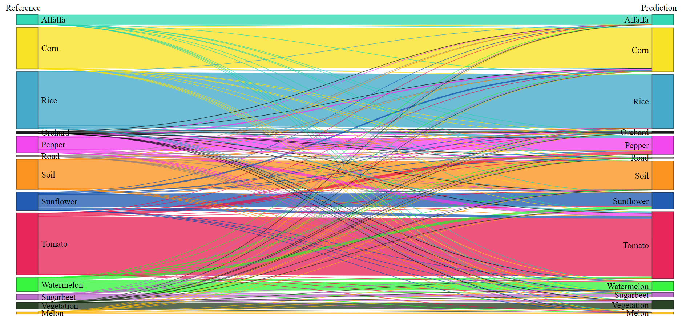
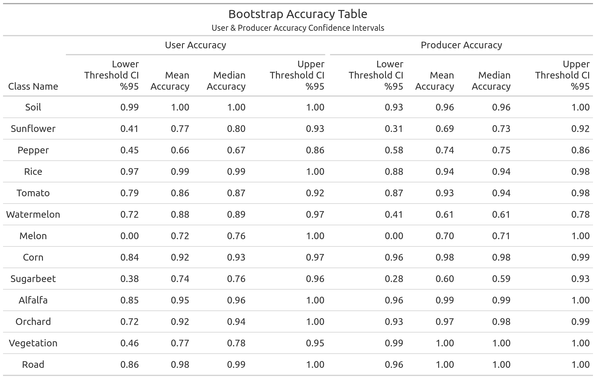
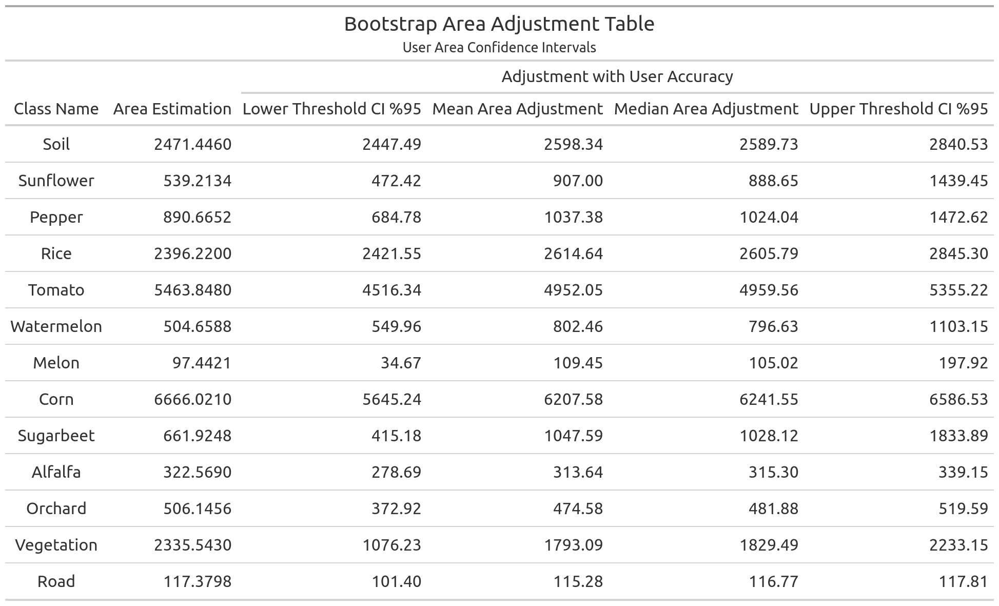

# bootmap 

Bootmatp is an R framework for calculating uncertainty metrics from a crop map.
We are now working on a paper to elaborate on our procedure and results.
A detailed documentation and a R package structure will be organized in this repository.

Hopefully, you will be able to create graphics and tables for your map accuracy assessments:

### Alluvial Plot

### Bootstrap Accuracy & Area Plots

### Bootstrap Accuracy & Area Tables

Accuracy Table              |  Area Table
:-------------------------:|:-------------------------:
  |  

### Crop Accuracy Plot

