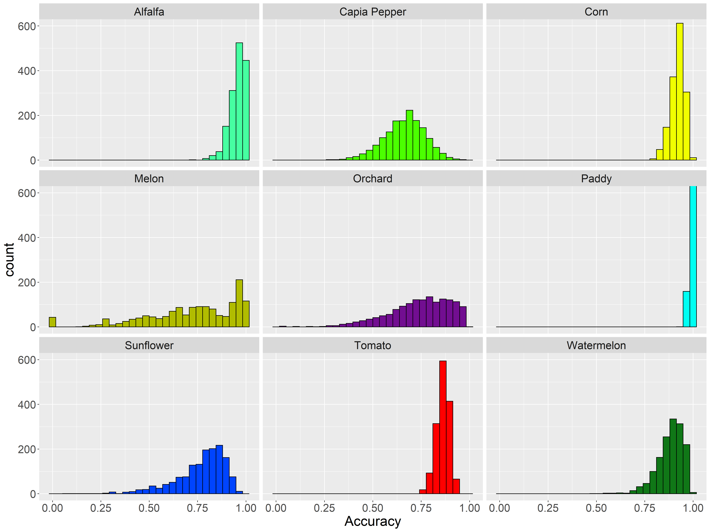
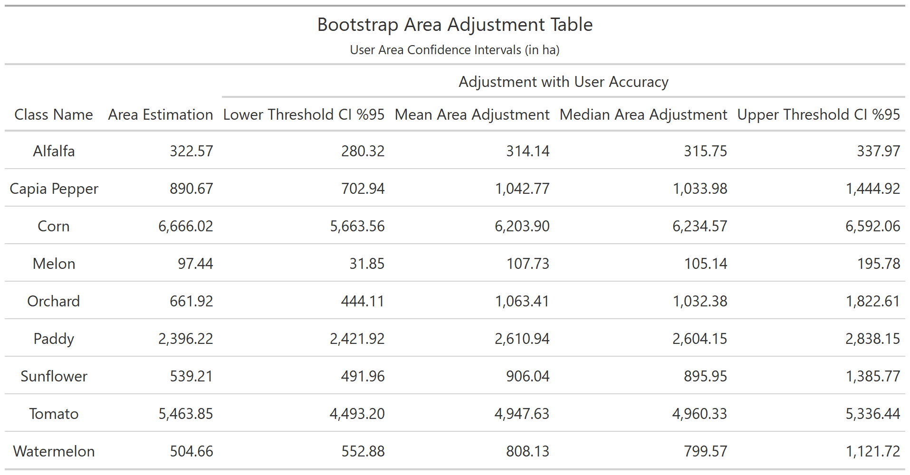

# bootmap 

Bootmap is an R framework for calculating uncertainty metrics from a crop map.
We are now working on a paper to elaborate on our procedure and results.
A detailed documentation and a R package structure will be organized in this repository.

When you open `main.R` script in `Rstudio`, please press `ALT + O` to see sections in the code.
Click the arrows at left to open and close the sections. 
You can reproduce the study when you set repo directory correctly in `setup.R` script.
Check below for abstraction steps in the codes.

Hopefully, you will be able to create graphics and tables for your map accuracy assessments:

### Alluvial Plot of Confusion

### Bootstrap Accuracy & Area Plots

These graphs displays the uncertainty of your model for each class and for each adjusted crop area.

Accuracy Plot              |  Area Plot
:-------------------------:|:-------------------------:
  |  

As you increase **n** in bootstrap, the crops with enough sample converges to normal distribution. They grow just as plants!

### Bootstrap Accuracy & Area Tables

The tables are a translation of graphs to another human-created language. 95% confidence is an estimate to give some advice for your uncertain life. 

Accuracy Table              |  Area Table
:-------------------------:|:-------------------------:
  |  

### Crop Uncertainty Plot

This is a zoom to an accuracy plot of the Tomato class.

